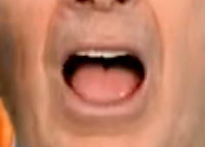
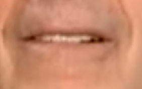
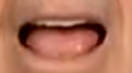

# 先定位，再发声：英语发音的口型与舌位训练

## 问题背景

学习英语发音时，一个常见问题是：明明知道单词怎样读，一说快，发音仍会变形，外语口音也会变得明显。视频把原因指向一个容易忽略的环节——舌头和嘴唇还没有到达准确位置，声音就已经发出来了。

本节的训练目标不是立刻追求自然语速，而是先建立稳定的发音动作：放慢速度，提前摆好口型和舌位，再用气流启动声音，并把每个单词的主要元音充分发出来。

## 口音改善的五步法

视频给出的五个步骤是：

1. **Speak slowly**：放慢语速，一次处理一个单词。
2. **Get into position**：让舌头和嘴唇先到达准确位置，并保持口腔放松。
3. **Take in air**：用嘴或鼻子轻轻吸气。
4. **Force out air**：每说一个词都主动送气，像“击中”词首一样清楚地启动声音。
5. **Make every word have a long vowel**：把每个词的主要元音充分拉长。

这五步不是彼此孤立的技巧，而是一条连续的动作链：

```text
放慢语速
→ 给发音器官留出移动时间
→ 舌头和嘴唇准确就位
→ 吸气并主动送气
→ 充分发出主要元音
```

慢速练习之所以重要，是因为它让舌头和嘴唇有时间找到位置。位置尚未稳定便追求速度，容易把旧的发音习惯一并加速。

## 九类发音位置

视频把常见的词首动作归为九类。下表忠实记录视频在本节中给出的字母分组、动作提示和例词；截图没有完整展示的细节不作推断。

| 分组 | 视频中的动作提示 | 示例词 |
| --- | --- | --- |
| A、E、I、O、U | 张开嘴，充分启动元音 | `answer`、`often`、`in`、`up` |
| B、M、P | 起音前紧闭双唇 | `best`、`mention`、`patient` |
| C、K、G | 使用同一组示范位置 | `can`、`kick`、`gone` |
| D、J、N、T | 舌尖向斜上方约 45° 抬起 | `duck`、`justice`、`nice`、`time` |
| F、V | 上齿放在下唇处 | `fast`、`very` |
| H | 嘴巴张开约 40% | `has`、`hasn't` |
| L | 舌尖放在上排牙齿下面的位置 | `long`、`lucky`、`lie` |
| R、S、Y | 先持续体会 `RRR…`、`SSS…`、`YYY…` 的起音 | `ran`、`send`、`yes` |
| W | 双唇收圆并向前突出，中央留一个小开口；配合手势提示 | `why` |

### 元音开头：充分张嘴

读以 A、E、I、O、U 开头的词时，先把嘴张开，再开始发声。



### C、K、G：示范嘴型

截图展示了 C、K、G 共用的外部嘴型。由于单张正面图片无法可靠呈现口腔内部的舌位，本节只把它作为外部视觉参照。


### F、V：上齿与下唇接触

F 和 V 使用相近的唇齿位置：上齿轻触下唇，让气流从狭窄通道通过。二者的关键区别是：F 不振动声带，V 振动声带。



### H：保持口腔开放

发 H 时，视频要求嘴巴张开约 40%，让气流从开放的口腔中呼出。



### W：双唇收圆并向前突出

发 W 时，双唇收圆并向前突出，中央只留一个小开口。先稳定这个嘴型，再发出 `W…` 并连接示例词 `why`。


## TH：九类位置之外的补充

视频随后单独补充了字母组合 **TH**：舌尖处于牙齿之间的位置。

- `tenth` 中的 TH 不振动声带；
- `this` 中的 TH 振动声带。

两者的舌位相近，区别主要在声带是否振动。

## 练习节奏：定位、停顿、再行动

视频用“还没有学会爬，就不能急着跑”说明训练顺序。具体练习节奏是：

1. **Find the position**：找到准确的口型或舌位。
2. **Wait 1 second**：保持一秒，确认位置已经稳定。
3. **Then move your hand**：再移动辅助练习的手，并同步启动发音。

W 的练习使用手势作为动作提示：先做出 W 的发音姿势，把手举在身前形成角度；位置稳定后再移动手并发音。手势本身不是发音动作，而是帮助大脑记住“先定位，再启动”的节奏。

## 核心机理：准确性为什么要先于速度

**发音位置（articulatory position）**是舌头、嘴唇、牙齿和下颌在发声前形成的相对位置。辅音的起始动作往往很短；如果起音时位置还没有完成，之后再调整也无法补回已经模糊的词首。

因此，本节方法强调先建立动作，再提高速度：

```text
准确定位
→ 重复稳定动作
→ 形成发音肌肉记忆
→ 逐渐缩短准备时间
→ 在更自然的语速下保持准确
```

“慢”只是训练阶段的手段，而不是最终说话方式。真正目标是让正确位置经过重复练习后变得自动化。

## 回到问题

说快时口音变明显，不一定是因为不知道正确读音，也可能是发音器官没有足够时间到位。解决方法不是单纯更用力或反复朗读整句，而是把单词拆回动作：先找位置，停一秒，再用气流启动，并清楚地延展主要元音。

练习时可以依次检查：

- 我是否为了赶速度，在口型到位前就发声？
- 词首辅音有没有清楚启动？
- 主要元音是否获得了足够的时长？
- 口腔是否保持放松，而不是为了“准确”而过度用力？

## 要点小结

- 五步法的核心顺序是：慢速、定位、吸气、送气、延展主要元音。
- 先定位再发声，可以避免舌头和嘴唇在起音之后才匆忙找位置。
- 九类位置为词首发音提供了动作提示；TH 作为额外的舌位组合单独练习。
- F/V 和两种 TH 都可通过“声带是否振动”区分同位置的清浊音。
- 练习应遵循“定位 → 停一秒 → 发音”的节奏，熟练后再逐步提高速度。
